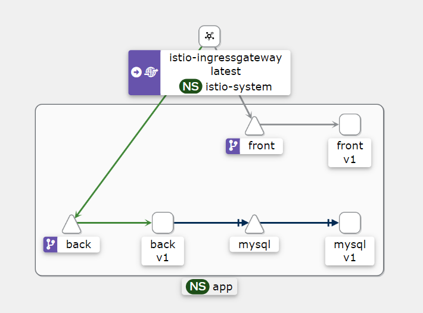
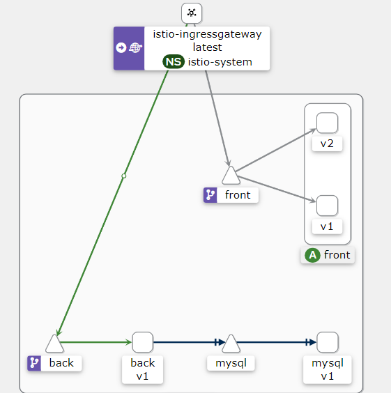

### Задание и Выполнение

#### Зарегистрироваться в google cloud(или любой другой облачной платформе) и создать проект с istio
1. Зарегистрироваться в google cloud(или любой другой облачной платформе) и создать проект с istio или установить minikube на локальную машину и установить туда istio. Первый вариант предпочтительней. 
2. Написать hello world spring boot приложение, возвращающая на GET запрос текущую дату. 
3. Составить docker file для сборки образа c вашим приложением 
4. Собрать образ, проверить локальную работоспособность
5. Запушить образ в один из публичных registry. Например dockerhub 
6. Удалить локальный образ, спулить* с dockerhub 
7. Развернуть приложение в google cloud с использованием istio


#### Продвинутое домашнее задание (не обязательно): 
1. Написать фронт приложение, которое будет красиво отображать текущую дату. Текущую дату фронт должен запрашивать у бэкэнда.
2. Развернуть оба приложения в google cloud с использованием istio
3. Пробить роут до приложения.
4. Выполнить несколько запросов, посмотреть как они будут выглядеть в Kiali 
5. Выпустить новую версию фронт приложения с изменением стиля отображения. 
6. Выполнить канареечное развертывание фронта, настроить на использование одного бека.
7. Проверить, что под единым роутом нам доступны то одна, то другая версия приложения.

###### ** Реализация **

##### Модификация существующей домашки
Вместо простого вывода даты решил взять существующее приложение из прошлой домашки (сервер возвращает переданный ему json массив (либо имеющиеся данные из собственной бд) по кускам с помощью webflux).
Немного изменил фронтенд и Dockerfile'ы для фронтенда и бэкенда.

Собрал бэкенд и фронтенд (фронтенд 2 раза - с разными цветами фона для визуального отличия) и запушил в [dockerhub](https://hub.docker.com).
Написал два файла ресурсов k8s для обеих частей приложения.

##### Подготовка istio
~~На [cloud.ru](https://cloud.ru) создал кластер с публичным IP (для управления с локального пк), в нём подключил istio.~~
На `cloud.ru` возникла проблема с политикой безопасности и istio, istio не мог создавать поды, т.к. хотел слать куда-то запросы, использую minikube

##### Запускаем кластер minikube и подключаем istio в кластер (памяти дал, чтоб наверняка):
```shell
minikube start --memory 11500 --cpus 4
```
```shell
istioctl install
```

##### Деплоим в namespace istio-system: kiali, grafana и prometheus, используя следующие файлы ресурсов:
```shell
kubectl apply -f https://raw.githubusercontent.com/istio/istio/release-1.21/samples/addons/kiali.yaml -n istio-system
```
```shell
kubectl apply -f https://raw.githubusercontent.com/istio/istio/release-1.21/samples/addons/grafana.yaml -n istio-system
```
```shell
kubectl apply -f https://raw.githubusercontent.com/istio/istio/release-1.21/samples/addons/prometheus.yaml -n istio-system
```

##### Подключение к Kiali
Теперь можно зайти в `kiali`:
Для этого нужно включить перенаправление трафика (в отдельной консоли, т.к. вызов заблокирует консоль)
```shell
kubectl port-forward svc/kiali 20001:20001 -n istio-system
```
Теперь kiali доступен на локальном порту 20001

##### Деплой приложения
Создадим namespace `app` для приложения и включим в нём инъекцию side-car'ов:
```shell
kubectl create namespace app
```
```shell
kubectl label namespace app istio-injection=enabled --overwrite
```

##### Деплой istio-gateway:
* Сам деплой
    ```shell
    kubectl apply -n app -f istio-k8s.yml
    ```

* Далее в отдельной консоли (вызов заблокирует консоль) открываем туннель:
    ```shell
    minikube tunnel
    ```

* Теперь перенаправим трафик на gateway (по умолчанию это 127.0.0.1:80) с помощью ngrok (ссылка нужна для `front` модулей):
    ```shell
    ngrok http 80
    ```

    Полученную ссылку нужно вставить в `front-k8s.yml` и `front-new-k8s.yml` файлы (env переменная `REACT_APP_BACKEND_URL`) для того,
    чтобы фронтенд мог отправлять запросы к бекенду (через gateway)

##### Деплой приложения:
```shell
kubectl apply -n app -f db-k8s.yml
```
```shell
kubectl apply -n app -f back-k8s.yml
```
```shell
kubectl apply -n app -f front-k8s.yml
```

##### Service Mesh граф из kiali:



##### Выпуск новой версию фронта с канареечным развёртыванием:
```shell
kubectl apply -n app -f front-new-k8s.yml
```
```shell
kubectl apply -n app -f front-new-canary-k8s.yml
```

##### Service Mesh граф из kiali после канареечного развёртывания:



##### Демонстрация
Теперь можно открывать по ссылке ngrok (из инкогнито, чтобы стирались куки), 
дизайн фронта будет меняться