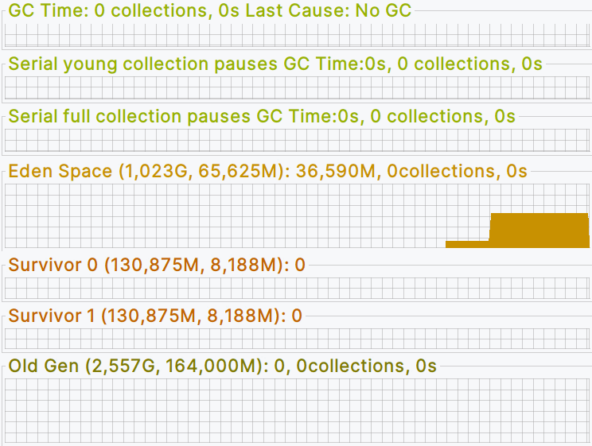
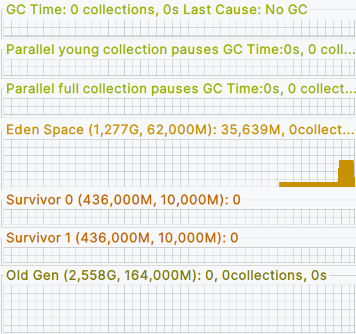
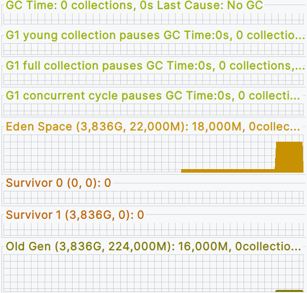

### Задание и Выполнение

#### JIT

Сделать цикл на 100000 итераций, в цикле в предварительно созданную Map<Integer, String>
сложить ключ - индекс, значение - "value" + индекс.

- Запустить с опцией -XX:+PrintCompilation, проанализировать информацию в консоли.
  ###### Основные моменты
  Методы, связанные с put начинают компилироваться в уровень 3 (C1)

  | Время | ID | Уровень | Метод                                 | Размер байт кода |
  |-------|----|---------|---------------------------------------|------------------|
  | 64    | 42 | 3       | java.util.HashMap::putVal             | 300              |
  | 67    | 39 | 3       | java.util.HashMap::hash               | 20               |
  | 68    | 45 | 3       | java.util.HashMap::afterNodeInsertion | 1                |
  | 69    | 46 | 3       | java.util.HashMap::put                | 13               |
  | 76    | 43 | 3       | java.util.HashMap::newNode            | 13               |
  | 77    | 44 | 3       | java.util.HashMap$Node::<init>        | 26               |
  
  Методы начинают перекомпилироваться в tier 4 (C2)

  | Время | ID | Уровень | Метод                                 | Размер байт кода | Деоптимизация    | Примечание                                                             |
  |-------|----|---------|---------------------------------------|------------------|------------------|------------------------------------------------------------------------|
  | 85    | 42 | 3       | java.util.HashMap::putVal             | 300              | made not entrant |                                                                        |
  | 85    | 46 | 3       | java.util.HashMap::put                | 13               | made not entrant |                                                                        |
  | 94    | 63 | 4       | java.util.HashMap::afterNodeInsertion | 1                |                  |                                                                        |
  | 94    | 58 | 3       | java.util.HashMap::putVal             | 300              |                  |                                                                        |
  | 95    | 45 | 3       | java.util.HashMap::afterNodeInsertion | 1                | made not entrant |                                                                        |
  | 96    | 59 | 3       | java.util.HashMap::put                | 13               |                  |                                                                        |
  | 97    | 66 | 4       | java.util.HashMap::hash               | 20               |                  |                                                                        |
  | 98    | 39 | 3       | java.util.HashMap::hash               | 20               | made not entrant |                                                                        |
  | 99    | 67 | 4       | java.util.HashMap::putVal             | 300              |                  |                                                                        |
  | 99    | 68 | 4       | java.util.HashMap::newNode            | 13               |                  |                                                                        |
  | 101   | 43 | 3       | java.util.HashMap::newNode            | 13               | made not entrant |                                                                        |
  | 101   | 69 | 4       | java.util.HashMap::put                | 13               |                  |                                                                        |
  | 110   | 72 | 3       | net.kravuar.jvm.Main::main @ 14 (OSR) | 65               |                  | ?Компилируется и подменяется (OSR) интепретируемый цикл в методе main? |
  | 115   | 58 | 3       | java.util.HashMap::putVal             | 300              | made not entrant |                                                                        |
  | 117   | 59 | 3       | java.util.HashMap::put                | 13               | made not entrant |                                                                        |
  
  Теперь начинают использоваться (и компилироваться, аналогично, сначала в tier 3, затем в tier 4) методы remove  

  | Время | ID | Уровень | Метод                                 | Размер байт кода | Деоптимизация    | Примечание |
  |-------|----|---------|---------------------------------------|------------------|------------------|------------|
  | 121   | 75 | 4       | java.util.HashMap::resize @ 151       | 356              |                  |            |
  | 129   | 77 | 3       | java.util.HashMap::removeNode         | 291              |                  |            |
  | 131   | 79 | 3       | java.util.HashMap::remove             | 26               |                  |            |
  | 131   | 81 | 4       | net.kravuar.jvm.Main::main @ 42 (OSR) | 65               |                  | ?Компилируется и подменяется (OSR) интепретируемый цикл в методе main? |
  | 132   | 78 | 3       | java.util.HashMap::afterNodeRemoval   | 1                |                  |            |
  | 142   | 82 | 4       | java.util.HashMap::removeNode         | 291              |                  |            |
  | 145   | 83 | 4       | java.util.HashMap::remove             | 26               |                  |            |
  | 147   | 77 | 3       | java.util.HashMap::removeNode         | 291              | made not entrant |            |
  | 148   | 84 | 4       | java.util.HashMap::afterNodeRemoval   | 1                |                  |            |
  | 149   | 78 | 3       | java.util.HashMap::afterNodeRemoval   | 1                | made not entrant |            |
  | 151   | 79 | 3       | java.util.HashMap::remove             | 26               | made not entrant |            |
  | 163   | 81 | 4       | net.kravuar.jvm.Main::main @ 42       | 65               | made not entrant |            |

- Запустить с опцией -XX:+PrintCompilation -XX:+UnlockDiagnosticVMOptions -XX:+PrintInlining , проанализировать
  информацию в консоли
  ###### Основные моменты
  
  При запуске будет показано, какие методы были за-инлайнены (для того, чтобы избежать накладных расходов на манипуляции с фреймами стека), какие нет и почему, например:
  - inline, если был за-инлайнен
  - callee is too large, если размер байт кода кандидата слишком велик для инлайна
  - callee uses too much stack, если кандидат занимает слишком много места для инлайна
  - no static binding, если нет статического связывания (не известно, что инлайнить)

#### GC
Plugis плагин: Visual GC Запустить приложение создающее много объектов с разными GC, 
посмотреть в jvisualvm как заполняются объекты в разных областях памяти(heap)

###### Анализ
Для всех сборщиков было сделано 3 шага: добавлялось по 1_000_000 `Integer` в `ArrayList`,
что создавало как долгоживущие объекты, так и короткоживущие - из-за перевыделений памяти под ArrayList

##### Serial GC

Стандартная работа GC: объекты создаются в Eden, затем перемещаются в и между Survivor Space 1/2, и попадают в Tenured.

##### Parallel GC

То же самое, что и serial, но паузы меньше.

##### G1 GC

(На третьем слайде шагов было сделано больше)

G1 проводил сборки чаще и немного быстрее Parallel, и при этом он использовал только 1 Survivor Space и перемещал данные сразу в Tenured.